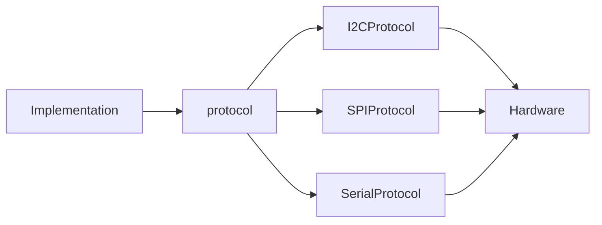

# Protocol 

This is designed to be an abstraction for devices that can use multiple communication protocols like SPI and I2C.
This is helpful when prototyping, as it allows you to switch your sensor's protocol in a single line rather that rewriting your entire code.




## Recommended usage

When writing the class/library for the device, make a pointer to type `protocol` a class member:

```cpp
protected:
    protocol* device;
```

Then have overloaded constructors for each protocol: 
```cpp
public:
    LSM6DSO32(TwoWire *pipe, uint32_t freq) { // constructor for I2C protocol
        device = new I2CProtocol(LSM6DSO32_DEFAULT_I2C_ADDRESS, pipe, freq);
    }
    
    LSM6DSO32(byte chipSelect, SPIClass& spi, SPISettings settings) {// constructor overload for SPI protocol
        device = new SPIProtocol(chipSelect, spi, settings, READ_BYTE, WRITE_BYTE);
    }
```

Then you can build code regardless of the protocol, using `device`. For example:
```cpp
uint8_t LSM6DSO32::enable_sdo_pullup(bool enable) {
    byte data = device->read_reg(LSM6DSO32_REGISTER::PIN_CTRL);
    setBit(&data, 6, enable);
    return device->write_reg(LSM6DSO32_REGISTER::PIN_CTRL, data);
}
```
### Alternatively
If you are using `protocol` independent of a class, your `device` will be of type (e.g.) `I2CProtocol` or `SPIProtocol`:

```cpp
I2CProtocol device = I2CProtocol(0x1C, &Wire, 400000);

// or
SPISettings settings = SPISettings(1000000, MSBFIRST, SPI_MODE0);
SPIProtocol device = SPIProtocol(CS, SPI, settings, 0x80, 0x00);
```
Remember to begin the protocol with
```cpp
device.protocol_begin();
```
then use the `read_reg` and `write_reg` functions as shown:
```cpp
byte WHO_AM_I = device.read_reg(0x0F);
byte mag_data[6];
device.read_regs(0x28, mag_data, 6);

device.write_reg(0x20, 0x67);
byte data_to_write[6] = {0x01, 0x02, 0x03, 0x04, 0x05, 0x06};
device.write_regs(0x28, data_to_write, 6);
```


TODO:
- UART protocol
